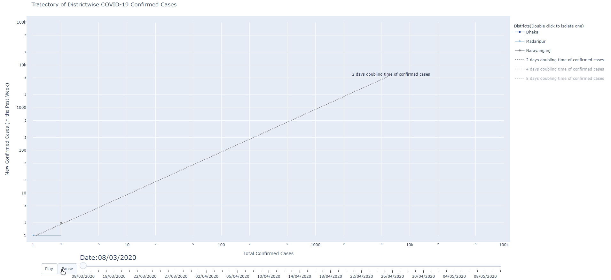

# Plotly-districtwise-case-trajectory-animation-of-covid
Plotly animation chart for rising of disctrict wise confirmed covid cases back in March 2020.

Many lines are messed up due to misinformation in dataset ! 

